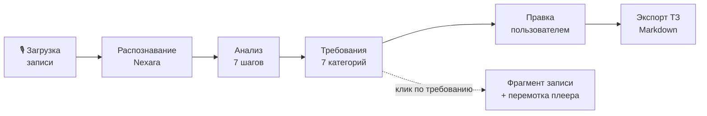
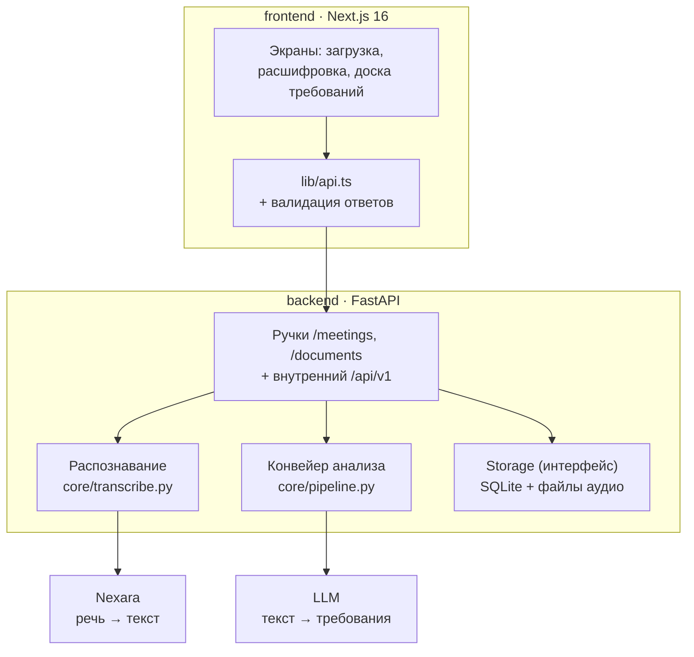

## Основной сценарий



1. Пользователь загружает аудио или видео встречи (до 200 МБ).
2. Сервер сразу отвечает `202` и обрабатывает запись в фоне — фронтенд
   опрашивает статус раз в три секунды.
3. Nexara расшифровывает запись с разделением говорящих на «Заказчика»
   и «Менеджера».
4. Конвейер извлекает требования семи категорий, каждое — с цитатой,
   таймкодом, ролью, приоритетом и оценкой уверенности.
5. Пользователь правит результат: редактирует, удаляет, добавляет своё,
   отмечает спорное как «требует уточнения».
6. Клик по требованию открывает фрагмент разговора, откуда оно взято,
   и перематывает плеер на этот момент.
7. Готовое ТЗ выгружается в Markdown; копия остаётся в «Документах».

## Архитектура



Обе внешние зависимости заменяемы конфигом, без правок кода:

| Слой | Реализации | Переключение |
|---|---|---|
| Распознавание | Nexara; адаптеры формата под SpeechKit v2/v3 и Whisper | `STT_PROVIDER` |
| Языковая модель | любой OpenAI-совместимый endpoint, YandexGPT, встроенный `mock` | `LLM_PROVIDER` |
| Хранилище | SQLite (пользователи, проекты, документы), файлы (аудио) | реализация интерфейса `Storage` |

`mock` — извлечение по лингвистическим правилам, без сети и ключей. Он нужен
не для галочки: на нём бесплатно работают все тесты, на нём фронтенд
разрабатывался, пока не было доступа к модели, и он же — запасной вариант
на защите, если откажет сеть.

## Как устроен анализ

Наивный подход — отправить расшифровку в модель одним запросом — на длинном
разговоре теряет детали в середине, не даёт трассировки до фрагмента
и не позволяет оценить уверенность. Вместо этого семь шагов:

| # | Шаг | Что делает |
|---|---|---|
| 1 | Нормализация | Чистит артефакты распознавания, зацикленные повторы, слова-паразиты; строит карту «символ → сегмент» |
| 2 | Смысловая сегментация | Режет по границам тем — пауза, смена говорящего, маркеры перехода, лексический разрыв — а не по счётчику символов |
| 3 | Карта разговора | Один дешёвый вызов: темы, роли, глоссарий заказчика. Идёт контекстом дальше |
| 4 | Извлечение | По чанкам параллельно, строгий JSON, у каждого элемента обязательная цитата |
| 5 | Проверка цитат | Ищет цитату в расшифровке якорным поиском по редким словам. Не нашли → `verified: false` и понижение уверенности |
| 6 | Дедупликация | Строгий лексический порог + досмотр «серой зоны» моделью |
| 7 | Связи и противоречия | Связывает сценарии и роли с требованиями, ищет несовместимые пары |

Падение одного чанка не роняет анализ: остальные доезжают.

**Почему дедупликация устроена именно так.** Замер на реальных формулировках
(`backend/probe_dedup.py`) показал, что лексической мерой перефразировки
и разные требования не разделяются: «корпоративная учётная запись» ↔
«корпоративная учётка» дают 0.55, а «уведомление на почту» ↔ «уведомление
в телеграм» — 0.80. Ошибки несимметричны: неверная склейка молча теряет
требование, лишний дубль пользователь удаляет в один клик. Поэтому
автоматический порог строгий, а спорные пары отдаются модели.

### Категории требований

`Функциональные требования` · `Пользовательские сценарии` · `Роли пользователей`
· `Ограничения` · `Важные условия` · `Открытые вопросы` · `Договорённости`

## Технологии

| | |
|---|---|
| **Бэкенд** | Python 3.11+, FastAPI, Pydantic v2, httpx, uvicorn |
| **Фронтенд** | Next.js 16, React 19, TypeScript, Tailwind CSS 4 |
| **Распознавание** | Nexara (диаризация, разметка ролей) |
| **Языковая модель** | GPT-5 mini через OpenAI-совместимый API; поддержаны YandexGPT и локальные модели |
| **Тесты** | 175 проверок бэкенда, 6 — фронтенда; все офлайн и бесплатны |

Языковые модели вызываются напрямую по HTTP, без SDK: формат запроса у каждого
провайдера свой, и лишний слой совместимости только мешал бы разбираться
в отказах — а разбираться приходится, у GPT-5 своё имя поля лимита и запрет
на температуру, отличную от единицы.

## Запуск

```bash
cd backend
pip install -r requirements.txt
cp .env.example .env      # вписать ключи
python -m uvicorn app.main:app --reload
```

```bash

cd frontend
npm install
echo NEXT_PUBLIC_API_URL=http://localhost:8000 > .env.local
npm run dev
```

Открыть <http://localhost:3000>. Документация API — <http://localhost:8000/docs>.
В VS Code настроена составная конфигурация: **F5 → «Всё вместе: фронт + бэк»**.

Ключи — только в `.env`, оба файла в `.gitignore`. Без `.env` бэкенд
поднимается на `mock` и работает без сети.

### Проверка

```bash
cd backend
python smoke_test.py       # основной сценарий целиком
python test_meetings.py    # соответствие контракту фронтенда
python check.py --show-source   # посмотреть готовое ТЗ глазами
```

`check.py` печатает результат так, как его увидит пользователь — с цитатами
и таймкодами. Автотесты отвечают на вопрос «не сломалось ли», этот скрипт —
на вопрос «осмысленно ли оно»; смотреть надо оба.

## Ограничения MVP

Честный список того, что в прототипе сделано не до конца:

- **База — SQLite.** Пользователи, их проекты и документы лежат в одном файле
  `backend/data/recastra.db`, аудио — рядом на диске. Для прототипа хватает;
  для многих одновременных пользователей нужен PostgreSQL — он подключается
  реализацией интерфейса `Storage`, не затрагивая ни конвейер, ни ручки.
- **Авторизация простая.** Регистрация и вход по почте и паролю, у каждого
  пользователя свои проекты и документы. Совместной работы над проектом,
  ролей и восстановления пароля нет.
- **Скорость.** Встреча на 42 минуты обрабатывается пять–восемь минут:
  рассуждающая модель тратит заметную часть времени на размышления.
  Лечится параллелизмом (`LLM_CONCURRENCY`) или моделью попроще.
- **Дедупликация работает внутри категории.** Одна и та же мысль может
  попасть и в «условия», и в «договорённости».
- **Роли пользователей извлекаются, но контейнера под них на фронтенде нет** —
  контракт предусматривает шесть разделов, а категорий семь.
- **Разметка говорящих зависит от распознавания.** Ошибки на границах реплик
  случаются; `NEXARA_NUM_SPEAKERS=2` их заметно снижает.

## Дополнительный функционал

Сверх обязательной части кейса реализовано:

| Возможность | Как сделано |
|---|---|
| Связь требования с фрагментом записи | Цитата-якорь + таймкод + перемотка плеера |
| Оценка уверенности | `confidence` у каждого элемента, отдельно — флаг проверки цитаты |
| Автоматическое выявление противоречий | Отдельный проход по требованиям, ограничениям и условиям |
| Приоритеты требований | MoSCoW, выводится по настойчивости формулировки заказчика |
| Разделение требований по ролям | Поле `role`, связи «роль ↔ требование» |
| Формирование user stories | «Как ‹роль›, я хочу ‹действие›, чтобы ‹ценность›» |
| Поиск по расшифровке | Отдельная ручка с подсветкой совпадений |
| Экспорт ТЗ | Markdown в браузере, копия сохраняется в «Документах» |
| Карта разговора | Темы, роли и глоссарий заказчика — основа временной шкалы |

## Структура репозитория

```
backend/          FastAPI
  app/
    api/          ручки: /meetings, /documents, /api/v1
    core/         конвейер анализа, распознавание, адаптеры форматов
      llm/        провайдеры языковых моделей и промпты
    storage/      интерфейс хранилища и база SQLite
  samples/        тестовая расшифровка
  *_test.py       175 проверок
frontend/         Next.js
  app/            экраны
  components/     доска требований
  lib/            клиент API, модель встречи, демо-режим
  docs/API.md     контракт между фронтендом и бэкендом
  tests/          6 проверок разбора и экспорта
```

Подробности по бэкенду — [backend/README.md](backend/README.md),
контракт API — [frontend/docs/API.md](frontend/docs/API.md).


### Удаление проектов и исправление расшифровки

- `DELETE /meetings/{id}` без тела запроса удаляет проект, расшифровку,
  анализ и аудиофайл. Экспортированные документы сохраняются отдельно.
  Ответ: `{"id":"<id>","deleted":true}`; отсутствующий проект — 404.
- `PATCH /meetings/{id}/transcript/{segment_id}/speaker`, где segment_id
  совпадает с ID из GET встречи (например `s0`), принимает
  `{"speaker":"Заказчик"}`. Допустимы также `Менеджер` и `Участник`.
  Возвращает обновлённую встречу. Во время обработки возвращает 409.
  Исправление сохраняется в текущем хранилище сервера; старые экспортированные
  ТЗ и результаты анализа автоматически не переписываются.
- В расшифровке роль можно исправить отдельно для каждой реплики.
  Обращения «Менеджер, …» больше не считаются метками говорящего.
  Явные метки с двоеточием поддерживаются, включая отдельные реплики.
  Нумерованные голоса не назначаются заказчику или менеджеру по порядку.
  Это исправление разметки текста, а не замена акустической диаризации:
  ошибки назначения ролей самим STT-сервисом могут потребовать ручной коррекции.
- Контейнеры анализа закрыты при открытии проекта; количество элементов видно.
