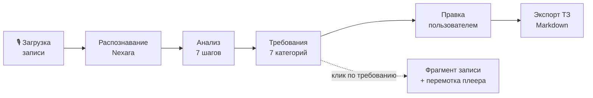
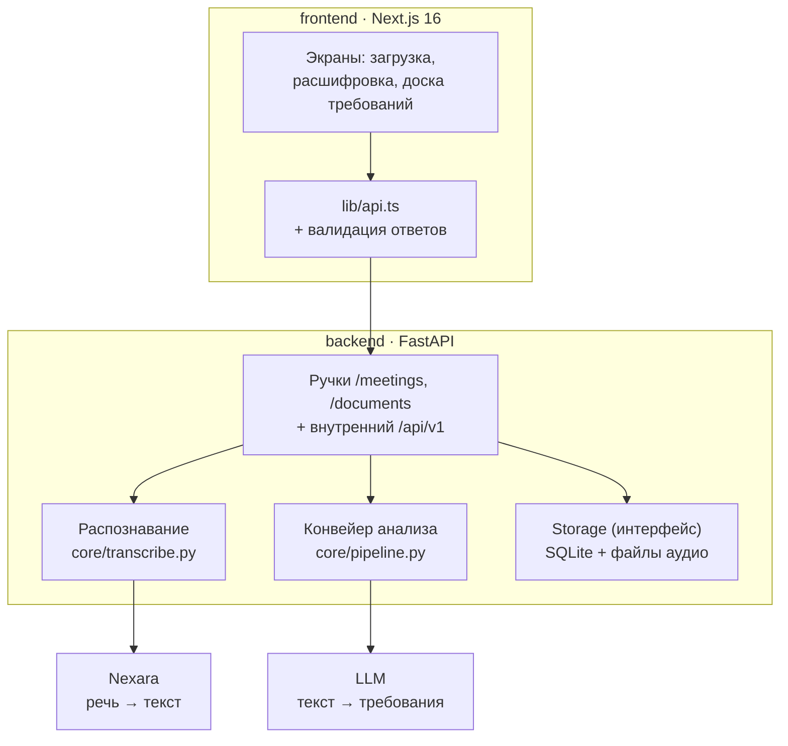

# RecAstra

Веб-приложение для преобразования разговора заказчика и менеджера в требования к продукту и черновик технического задания.



1. Пользователь загружает аудио или видео встречи.
2. Сервер сразу отвечает `202` и обрабатывает запись в фоне — фронтенд
   опрашивает статус раз в три секунды.
3. Nexara расшифровывает запись с разделением говорящих на «Заказчика»
   и «Менеджера».
4. Конвейер извлекает требования семи категорий, каждое — с цитатой,
   таймкодом, ролью, приоритетом и оценкой уверенности.
5. Пользователь правит результат: редактирует, удаляет, добавляет своё,
   отмечает спорное как «требует уточнения».
6. Клик по требованию открывает фрагмент разговора, откуда оно взято,
   и перематывает плеер на этот момент.
7. Готовое ТЗ выгружается в Markdown; копия остаётся в Документах.

## Архитектура



Обе внешние зависимости заменяемы конфигом, без правок кода:

| Слой | Реализации | Переключение |
|---|---|---|
| Распознавание | Nexara; адаптеры формата под SpeechKit v2/v3 и Whisper | `STT_PROVIDER` |
| Языковая модель | любой OpenAI-совместимый endpoint, YandexGPT, встроенный `mock` | `LLM_PROVIDER` |
| Хранилище | SQLite (пользователи, проекты, документы), файлы (аудио) | реализация интерфейса `Storage` |

## Возможности

- Регистрация, вход и личные проекты.
- Загрузка аудио, расшифровка через Nexara, таймкоды и исправление роли участника.
- Анализ: функциональные требования, пользовательские сценарии, ограничения, важные условия, открытые вопросы и договорённости.
- Добавление, редактирование и удаление карточек, отметки об уточнении.
- Приоритеты MoSCoW, сортировка и оценка уверенности анализатора.
- Сохранение правок, экспорт ТЗ в Markdown, просмотр и удаление документов.
- Удаление проекта вместе с записью; экспортированные документы сохраняются.

Стек: Next.js 16, React 19, TypeScript, FastAPI, Python 3.12, SQLite.

## Запуск через Docker

Нужны Git, Docker Engine и Docker Compose 2.24 или новее.

```bash
git clone https://github.com/illusion376/RecAstra.git
cd RecAstra
git switch develop
cp .env.example .env
cp backend/.env.example backend/.env
```

В PowerShell вместо `cp` можно использовать `Copy-Item`. Не перезаписывайте уже настроенные `.env`.

Корневой `.env` задаёт адрес API для браузера и порты:

```dotenv
NEXT_PUBLIC_API_URL=http://localhost:8000
FRONTEND_PORT=3000
BACKEND_PORT=8000
```

Настройки анализа и распознавания находятся в `backend/.env`.
По умолчанию `LLM_PROVIDER=mock`: анализ работает по правилам без внешней модели.
`STT_PROVIDER=none` отключает распознавание аудио. Для загрузки и обработки записей укажите `STT_PROVIDER=nexara` и `NEXARA_API_KEY`.
Для анализа нейросетью настройте LLM-провайдера по [инструкции бэкенда](backend/README.md).

```bash
docker compose up -d --build
docker compose ps
```

Фронтенд: http://localhost:3000. Документация API: http://localhost:8000/docs.
Зарегистрируйте пользователя перед работой с проектами.

## Размещение на сервере

Для прямого доступа по IP в корневом `.env` задайте:

```dotenv
NEXT_PUBLIC_API_URL=http://SERVER_IP:8000
FRONTEND_PORT=3000
BACKEND_PORT=8000
```

В `backend/.env`: `CORS_ORIGINS=http://SERVER_IP:3000`, `AUTH_REQUIRED=true`.
Замените `SERVER_IP` адресом сервера. Для сайта с доменом настройте HTTPS через обратный прокси:

| Настройка | Пример |
| --- | --- |
| Корневой `NEXT_PUBLIC_API_URL` | `https://api.example.com` |
| Бэкенд `CORS_ORIGINS` | `https://example.com` |
| Корневой `FRONTEND_PORT` | `127.0.0.1:3000` |
| Корневой `BACKEND_PORT` | `127.0.0.1:8000` |

Прокси на сервере направляет `example.com` на `127.0.0.1:3000`, а `api.example.com` на `127.0.0.1:8000`.
Адрес API должен быть доступен браузеру пользователя. `localhost` и имя Docker-сервиса `backend` для внешних посетителей не подходят.

При Docker-запуске `frontend/.env` не используется: Compose передаёт адрес API из корневого `.env` при сборке.
После изменения адреса API пересоберите фронтенд. Изменения переменных бэкенда применяются при пересоздании контейнера:

```bash
docker compose up -d --build
```

## Данные и обновление

SQLite и секрет сессий хранятся в томе `backend-data`, аудио — в `backend-media`.
Compose задаёт пути `/app/data/recastra.db` и `/app/media` независимо от `backend/.env`.
Пустой `AUTH_SECRET` автоматически заменяется секретом в постоянном томе. Если секрет задан вручную, сохраняйте его при обновлении.

```bash
git pull --ff-only
docker compose up -d --build
docker compose logs --tail=100 backend frontend
```

Перед обновлением сохраните резервные копии обоих томов. Для согласованной копии SQLite остановите бэкенд на время копирования.
Не используйте `docker compose down -v`, если хотите сохранить данные: флаг `-v` удаляет тома.
Дождитесь завершения обработки записей перед перезапуском: фоновые задания не восстанавливаются автоматически.

## Разработка и проверки

- [Бэкенд: запуск, переменные и тесты](backend/README.md).
- [Фронтенд: запуск и проверки](frontend/README.md).
- [Контракт API](frontend/docs/API.md).

## Использование ИИ

| ChatGPT / Claude - Интеграция сервисов - Работа с контрактом FastAPI, и обработкой ошибок |
| ChatGPT / Claude - Проверка и отладка - Анализ ошибок, подготовка и запуск тестов, проверка типов и линтера |

ИИ помогал создавать и редактировать часть кода и документации

## Ограничения

Оценка уверенности — самооценка анализатора, а не гарантия правильности требования.
Распознавание голосов и назначение ролей могут ошибаться. ТЗ следует проверить перед согласованием.
SQLite и фоновые задания рассчитаны на один процесс бэкенда; несколько реплик приложения требуют общего хранилища и очереди задач.
Экспорт создаёт отдельный снимок: последующие изменения проекта не меняют уже сохранённые документы.

## Файл для теста

В папке test лежит файл test.mp3 - его можно использовать для загрузки